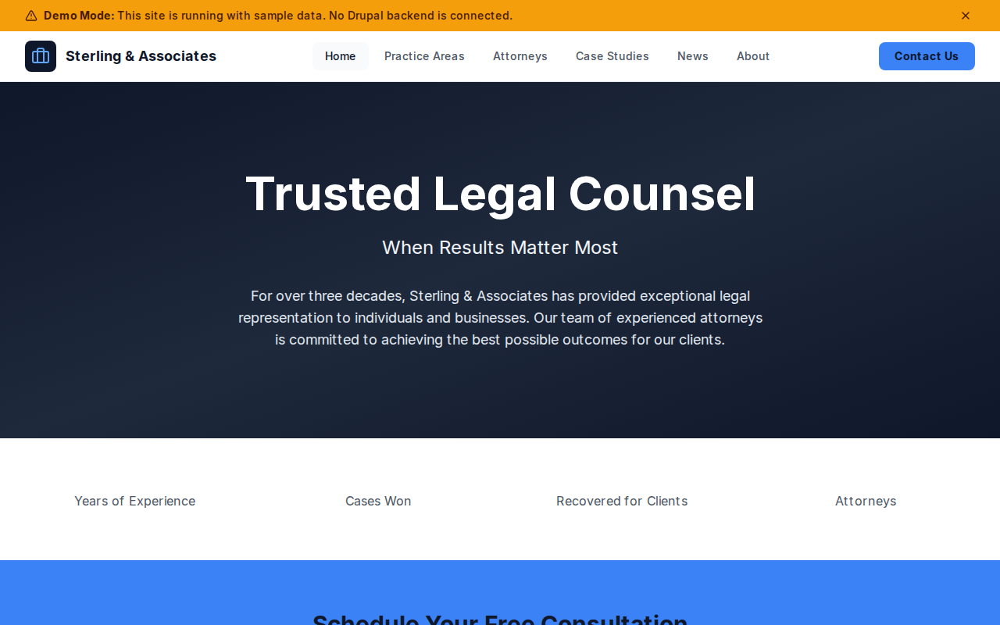

# Decoupled Law Firm

A professional website starter for law firms, legal practices, and attorney offices. Built with Next.js 15 and Drupal CMS, this starter showcases practice areas, attorney profiles, case studies, and firm news to help legal practices establish a strong online presence and attract new clients.



[](https://vercel.com/new/clone?repository-url=https://github.com/nextagencyio/decoupled-law-firm&project-name=law-firm-site)

## Features

- **Practice Areas** -- Present legal services with detailed descriptions and featured images
- **Attorneys** -- Showcase attorney profiles with credentials, education, bar admissions, practice areas, and contact information
- **Case Studies** -- Highlight notable cases with outcomes, practice areas, and detailed narratives
- **News** -- Publish firm news, legal updates, and press releases with categories and featured flags
- **Homepage** -- Professional hero section, firm statistics (years, cases won, recovery amounts, attorneys), featured practice areas, and consultation CTA
- **Basic Pages** -- Static content for About, Contact, and firm information

## Quick Start

### 1. Clone the template

```bash
npx degit nextagencyio/decoupled-law-firm my-law-firm-site
cd my-law-firm-site
npm install
```

### 2. Run interactive setup

```bash
npm run setup
```

This interactive script will:
- Authenticate with Decoupled.io (opens browser)
- Create a new Drupal space
- Wait for provisioning (~90 seconds)
- Configure your `.env.local` file
- Import sample content

### 3. Start development

```bash
npm run dev
```

Visit [http://localhost:3000](http://localhost:3000)

---

## Manual Setup

If you prefer to run each step manually:

<details>
<summary>Click to expand manual setup steps</summary>

### Authenticate with Decoupled.io

```bash
npx decoupled-cli@latest auth login
```

### Create a Drupal space

```bash
npx decoupled-cli@latest spaces create "Sterling & Associates"
```

Note the space ID returned (e.g., `Space ID: 1234`). Wait ~90 seconds for provisioning.

### Configure environment

```bash
npx decoupled-cli@latest spaces env 1234 --write .env.local
```

### Import content

```bash
npm run setup-content
```

This imports the following sample content:

**Practice Areas:**
- Corporate Law (mergers & acquisitions, governance, securities regulation)
- Commercial Litigation (breach of contract, class action defense, IP disputes)
- Real Estate Law (commercial leasing, acquisitions, land use & zoning)
- Employment Law (discrimination, wage & hour, non-compete agreements)

**Attorneys:**
- James A. Sterling -- Founding Partner (Corporate Law, Commercial Litigation)
- Sarah L. Chen -- Senior Partner (Real Estate Law)
- Michael D. Rodriguez -- Partner (Employment Law)
- Elizabeth M. Thompson -- Associate (Commercial Litigation)

**Case Studies:**
- Tech Sector Merger Defense ($1.2B favorable merger at 40% premium)
- Employment Class Action Defense (class certification denied, case dismissed)
- Mixed-Use Development Transaction ($350M development approved in 8 months)

**News:**
- Sterling & Associates Opens New West Coast Office
- Firm Recognized in U.S. News Best Law Firms 2026
- Firm Launches Pro Bono Immigration Initiative

**Pages:**
- About Sterling & Associates
- Contact Us

</details>

## Content Types

### Practice Area
| Field | Type | Description |
|-------|------|-------------|
| title | string | Practice area name |
| body | rich text | Detailed practice area description |
| image | image | Featured image |

### Attorney
| Field | Type | Description |
|-------|------|-------------|
| title | string | Attorney name |
| body | rich text | Attorney biography |
| practice_area | term[] | Practice area specializations |
| role | term[] | Role (Partner, Associate, etc.) |
| email | string | Contact email |
| phone | string | Contact phone |
| office | string | Office location |
| photo | image | Attorney headshot |
| education | rich text | Education credentials |
| bar_admissions | string | Bar admissions |

### Case Study
| Field | Type | Description |
|-------|------|-------------|
| title | string | Case study title |
| body | rich text | Detailed case narrative |
| practice_area | term[] | Related practice areas |
| outcome | string | Case outcome summary |
| image | image | Featured image |

### News Article
| Field | Type | Description |
|-------|------|-------------|
| title | string | Article headline |
| body | rich text | Full article text |
| image | image | Featured image |
| category | term[] | News category |
| featured | boolean | Featured article flag |

### Homepage
| Field | Type | Description |
|-------|------|-------------|
| hero_title | string | Main headline |
| hero_subtitle | string | Supporting tagline |
| hero_description | rich text | Hero body copy |
| stats_items | paragraph[] | Firm statistics |
| featured_practices_title | string | Practice areas section heading |
| cta_title | string | Call-to-action heading |
| cta_description | rich text | CTA body copy |
| cta_primary / cta_secondary | string | CTA button labels |

## Customization

### Colors & Branding
Edit `tailwind.config.js` to customize the slate and blue color scheme. Update the Header component logo and firm name.

### Content Structure
Modify `data/law-firm-content.json` to add or change content types and sample content.

### Components
React components are in `app/components/`. Key files:
- `HomepageRenderer.tsx` -- Landing page with hero, stats, and CTA
- `AttorneyCard.tsx` / `PracticeAreaCard.tsx` -- Attorney and practice area listing cards
- `CaseStudyCard.tsx` / `NewsCard.tsx` -- Case study and news listing cards
- `Header.tsx` -- Navigation and branding

## Demo Mode

Demo mode allows you to showcase the application without connecting to a Drupal backend.

### Enable Demo Mode

```bash
NEXT_PUBLIC_DEMO_MODE=true
```

### Removing Demo Mode

1. Delete `lib/demo-mode.ts`
2. Delete `data/mock/` directory
3. Delete `app/components/DemoModeBanner.tsx`
4. Remove `DemoModeBanner` from `app/layout.tsx`
5. Remove demo mode checks from `app/api/graphql/route.ts`

## Deployment

### Vercel (Recommended)
[](https://vercel.com/new/clone?repository-url=https://github.com/nextagencyio/decoupled-law-firm)

Set `NEXT_PUBLIC_DEMO_MODE=true` in Vercel environment variables for a demo deployment.

### Other Platforms
Works with any Node.js hosting platform that supports Next.js.

## Documentation

- [Decoupled.io Docs](https://www.decoupled.io/docs)
- [Next.js Documentation](https://nextjs.org/docs)
- [Drupal GraphQL](https://www.decoupled.io/docs/graphql)

## License

MIT
